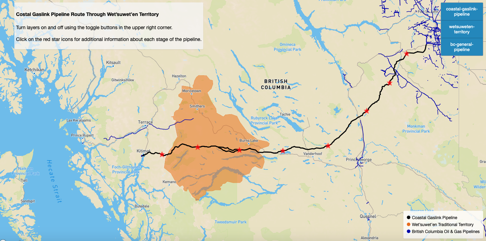

# Spatial Narratives of the 2020 Coastal GasLink Pipeline Protests & the Impacts of Extraction Industries Across BC

[Link to Group Essay](https://arcg.is/ODH0y)

[Link to Map 1: Coastal GasLink Route Through Wet’suwet’en Territory](https://ubc-geob472-spring2021.github.io/Final_Project_2020_Pipeline_Protests/Map_1.html)

[Link to Map 2: Coastal GasLink Impacts on the Wet'suwet'en Nation](https://ubc-geob472-spring2021.github.io/Final_Project_2020_Pipeline_Protests/Map_2.html)

[Link to Map 3: The 2020 Canadian Pipeline and Railway Protests Timeline](https://ubc-geob472-spring2021.github.io/Final_Project_2020_Pipeline_Protests/Map_3/Map_3.html)
