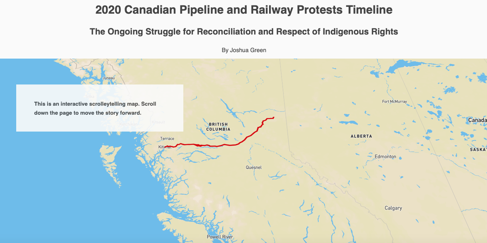

# Spatial Narratives of the 2020 Coastal GasLink Pipeline Protests & the Impacts of Extraction industries across BC

Link to Group Essay

[Link to Map 1: Coastal GasLink Route Through Wet’suwet’en Territory](https://jagreen1.github.io/2020_Pipeline_Protest_Story/Map%201/index-testing8.html?fbclid=IwAR0ynp1Q88RQeuVDRthdedLzfcsewGaw3NrooVI7iRbAiCFO8AW9OmYUpjE)

[Link to Map 2: Coastal GasLink Impacts on the Wet'suwet'en Nation](https://jagreen1.github.io/2020_Pipeline_Protest_Story/map-two.html?fbclid=IwAR3dl5J_doXwxXbI0xWAaS1I5ktlsHMcw98y3tuPrVsLCRu07LVoqxbvjR8)

[Link to Map 3: The 2020 Canadian Pipeline and Railway Protests Timeline](https://jagreen1.github.io/2020_Pipeline_Protest_Story/storytelling_main/src/index.html?fbclid=IwAR3j_hozbhz5SQehGhu0ASWWb6R4jn8MyUFQKeI_QH6zIFCQWCHS3DzJ5Z4)
